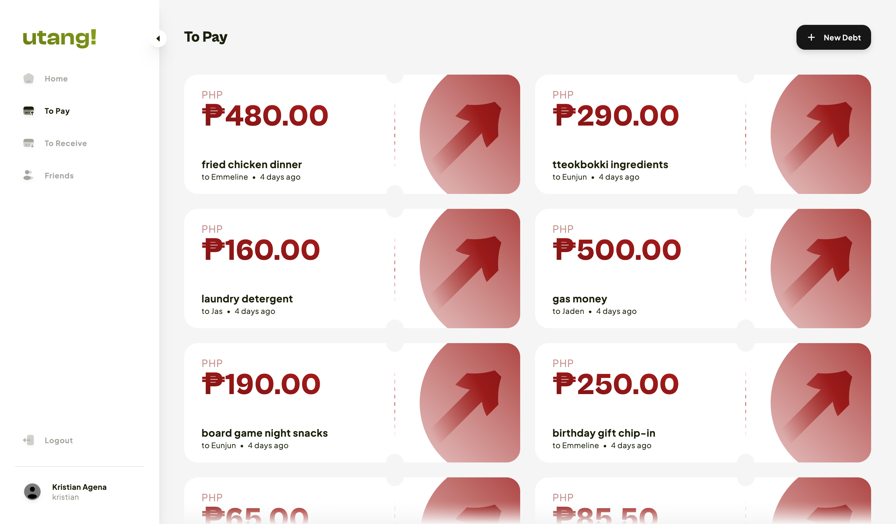
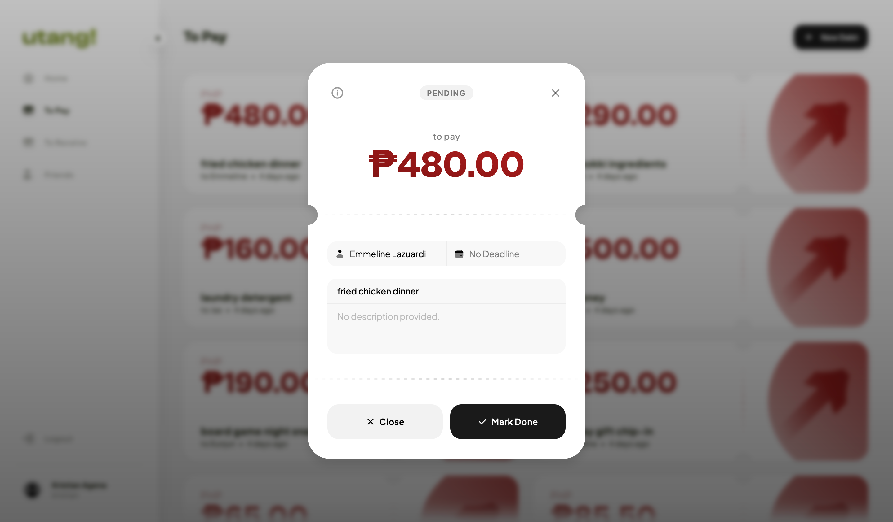
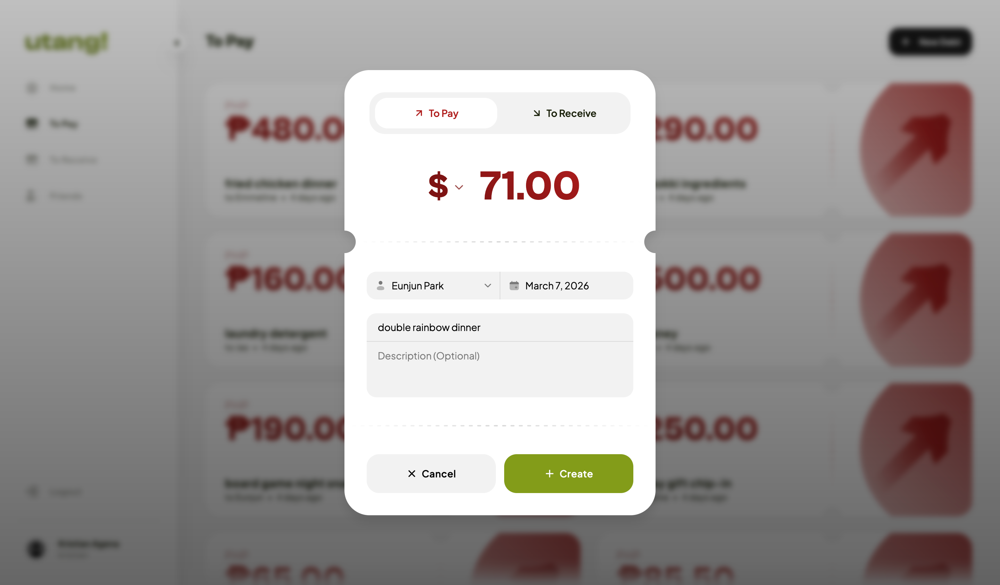

# Utang

> **A minimalist debt tracking application.** Track who owes you, and who you owe.

"Utang" translates to "debt" in Tagalog, perfectly capturing the core purpose of this application: simplifying how you track shared expenses among friends.





---

## Features

- **Friend Management**: Easily search for users and add them as friends.
- **Debt Tracking**: Keep a reliable record of shared expenses and loans between friends and strangers.
- **Modern UI/UX**: Enjoy a beautifully animated interface featuring smooth layout shifts and semantic, accessible forms.
- **Secure Auth**: Robust session-based authentication to keep your data safe.

---

## Tech Stack

### Frontend

- **Framework**: React 19, React Router v7
- **Styling**: Tailwind CSS v4, Shadcn/UI, Radix UI
- **State & Data Fetching**: TanStack React Query, Axios
- **Animations**: Framer Motion
- **Tooling**: Vite, TypeScript

### Backend

- **Framework**: Node.js, Express
- **Database**: PostgreSQL (Dockerised)
- **ORM**: Drizzle ORM
- **Auth**: Lucia Auth, Argon2
- **Validation**: Zod

---

## Quick Start

### Requirements

- [Node.js](https://nodejs.org/)
- [Docker Desktop](https://www.docker.com/) (for the PostgreSQL database)

### 1. Database Setup

Navigate to the `server` directory and start the local PostgreSQL database using Docker. The configuration is defined in `server/docker-compose.yml`.

```bash
cd server
docker-compose up -d
```

### 2. Backend Setup

From the `server` directory, install dependencies and prepare your database schema:

```bash
npm install
npm run db:generate
npm run db:push
npm run dev
```

_(Optional)_ You can populate the database with dummy data by running `npm run db:seed` in a separate terminal.

### 3. Frontend Setup

Open a new terminal, navigate to the `client` directory, and start the frontend development application:

```bash
cd client
npm install
npm run dev
```

The frontend application should now be accessible in your web browser, typically at `http://localhost:5173`.

---

## Scripts

### Server

- `npm run db:studio` - Launches Drizzle Studio.
- `npm run test` - Runs backend tests.
- `npm run db:reset` - Resets and wipes the database.

### Client

- `npm run build` - Builds the frontend for production.
- `npm run lint` - Runs eslint linting to enforce code quality.

---

## Licence

MIT License. See [LICENSE](LICENSE) for details.
