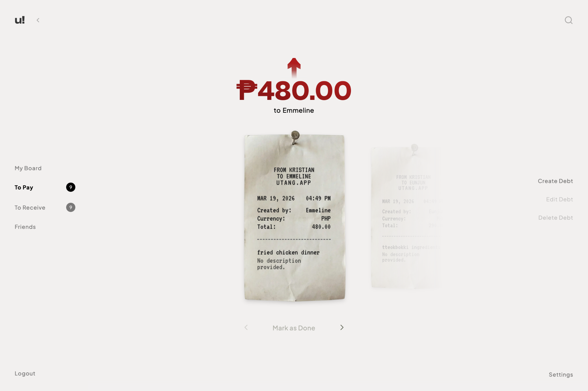
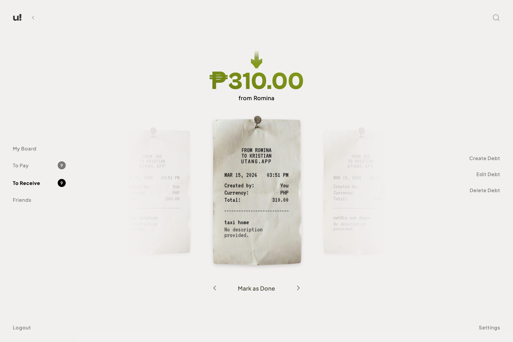
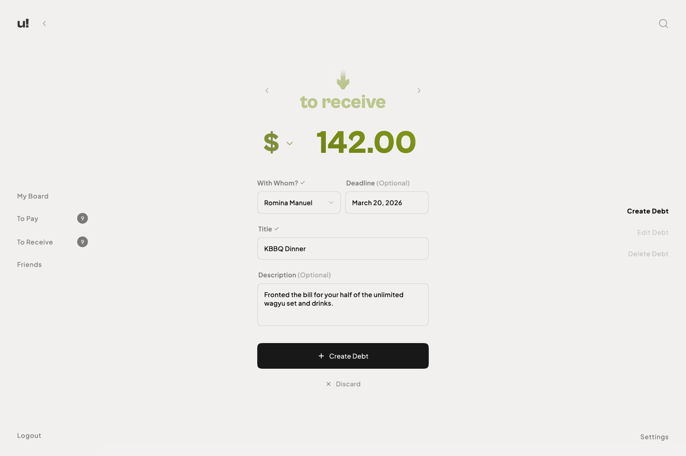

# Utang

[](https://github.com/krsagn/utang/actions/workflows/ci.yml)
[](https://coderabbit.ai/)
[](https://codecov.io/gh/krsagn/utang)

> **Full-stack debt tracker with real-time WebSocket updates, email notifications, session auth, a 65-test integration suite, and a Framer Motion-animated React 19 frontend.**

<!-- [Live Demo](https://your-domain.com) -->

_"Utang" translates to "debt" in Tagalog, perfectly capturing the core purpose of this application: simplifying how you track shared expenses among friends._

<!-- markdownlint-disable MD033 -->
<p align="center">
  
  
  
</p>
<!-- markdownlint-enable MD033 -->

---

## Features

- **Friend Management**: Easily search for users and add them as friends.
- **Debt Tracking**: Keep a reliable record of shared expenses and loans between friends and strangers.
- **Real-Time Updates**: Debt and friendship changes are pushed instantly to all connected clients via WebSockets — no refreshing required.
- **Email Notifications**: Automated emails are sent when debts are created or updated, powered by Resend.
- **Modern UI/UX**: Enjoy a beautifully animated interface featuring smooth layout shifts and semantic, accessible forms.
- **Secure Auth**: Robust session-based authentication to keep your data safe.

---

## Tech Stack

### Frontend

- **Framework**: React 19, React Router v7
- **Styling**: Tailwind CSS v4, Base UI, Radix UI (Shadcn CLI for scaffolding)
- **State & Data Fetching**: TanStack React Query, Axios
- **Animations**: Framer Motion
- **Tooling**: Vite, TypeScript, CodeRabbit (AI PR Reviews)

### Backend

- **Framework**: Node.js, Express
- **Database**: PostgreSQL (Dockerised)
- **ORM**: Drizzle ORM
- **Auth**: Lucia Auth, Argon2
- **Validation**: Zod
- **Real-Time**: Socket.io (WebSockets), Redis adapter for multi-instance support
- **Background Jobs**: BullMQ (Redis-backed job queue)
- **Email**: Resend
- **Cache & Queue**: Redis (Dockerised)

---

## Quick Start

### Requirements

- [Node.js](https://nodejs.org/)
- [Docker Desktop](https://www.docker.com/) (for PostgreSQL and Redis)

### 1. Database Setup

Navigate to the root directory and start the local PostgreSQL and Redis services using Docker. The configuration is defined in `docker-compose.yml`.

```bash
docker compose up -d
```

### 2. Backend Setup

From the `server` directory, install dependencies and prepare your database schema:

```bash
cd server
npm install
npm run db:generate
npm run db:push
npm run dev
```

_(Optional)_ You can populate the database with dummy data by running `npm run db:seed` in a separate terminal.

### 3. Frontend Setup

Open a new terminal, navigate to the `client` directory, and start the frontend development application:

```bash
cd client
npm install
npm run dev
```

The frontend application should now be accessible in your web browser, typically at `http://localhost:5173`.

> **Tip:** Docker runs detached in the background. The backend and frontend each need their own terminal.

---

## Scripts

### Server

- `npm run db:studio` - Launches Drizzle Studio.
- `npm run test` - Runs backend tests.
- `npm run db:reset` - Resets and wipes the database.
- `npm run db:fresh` - Resets the database and runs the seed script.
- `npm run test:coverage` - Runs backend tests with a detailed coverage report.

### Client

- `npm run build` - Builds the frontend for production.
- `npm run lint` - Runs eslint linting to enforce code quality.
- `npm run test` - Runs frontend unit tests.

---

## Testing

The backend has an integration test suite covering all API endpoints and core business logic, with total project coverage tracked via Codecov. The frontend also has a Vitest unit test suite covering shared utility logic.

Run the test suite:

```bash
cd server
npm test
```

Run with a detailed coverage report:

```bash
cd server
npm run test:coverage
```

---

## License

MIT License. See [LICENSE](LICENSE) for details.
